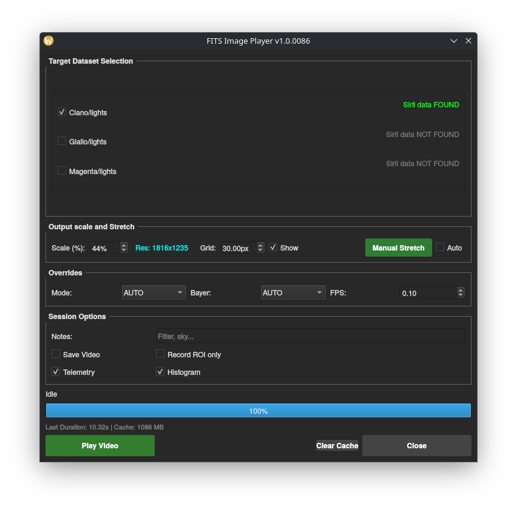
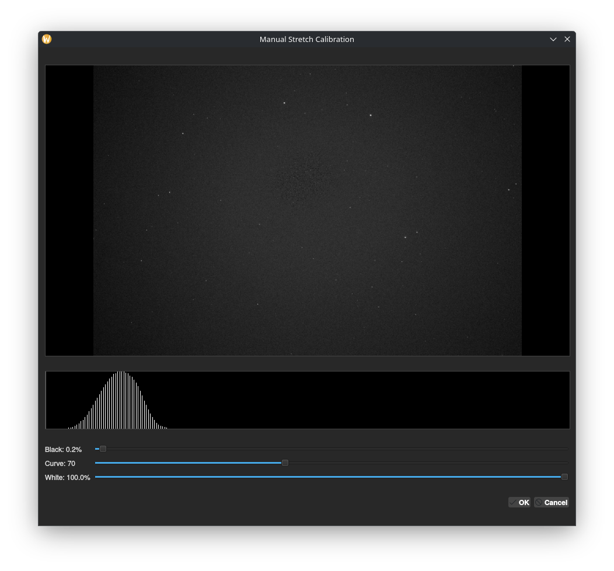
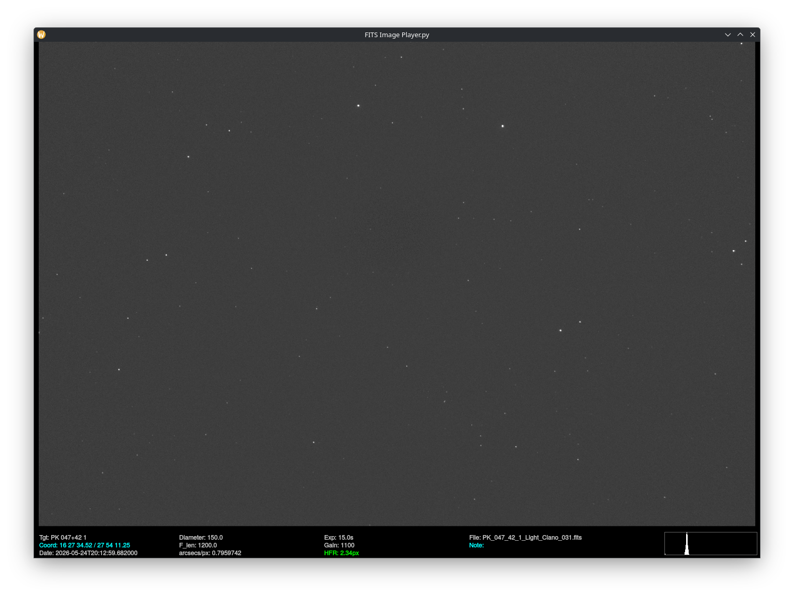

# 🎯 FITS Image Player v1.0.0092
### Native Astrophotography Review & Streaming Engine for Siril

## 📝 Description
This application operates as a frame playback control panel featuring an integrated rendering engine designed specifically for **Siril**. It inherits Siril's current Working Directory (CWD) to dynamically locate `lights/` and `process/` folders. It applies a **Balanced Background Neutralization** stretch—a multi-core, non-linear midtone stretching algorithm—to render frames smoothly with neutral sky backgrounds and perfectly balanced color channels.

---

## 🌟 Key Features

*   **Balanced Pro Stretching:** Uses an advanced algorithm that normalizes channels based on median values (removing the typical green cast) and applies a user-adjustable MTF curve (Black point, White point, and Midtones).
*   **Dynamic Histogram:** Unlike older versions, the real-time histogram now reflects the **final pixel values of the processed PNG**, showing the distribution after your manual or auto-stretch is applied.
*   **Smart Debayering:** Features an **Auto-Detect** mode that reads the Bayer pattern directly from the FITS header. It also allows **Manual Override** (RGGB, BGGR, GBRG, GRBG) for files with missing or incorrect metadata.
*   **FITS Header Extraction:** Automatically extracts and displays critical session data from headers, including:
    *   **Target** (OBJECT)
    *   **Coordinates** (RA/DEC formatted to HMS/DMS)
    *   **Date of Observation** (DATE-OBS)
    *   **Hardware Info:** Aperture Diameter (APTDIA), Focal Length (FOCALLEN), and Pixel Scale.
    *   **Exposure Parameters:** Exposure Time and Gain.
*   **User-Defined Scaling:** To optimize performance on different display resolutions, users can set a custom **Scaling Factor (%)** for the generated preview frames.
*   **Live HFR Tracking:** If registration data is found, it performs dynamic indexing of real-time star quality metrics (HFR/FWHM) parsed directly from Siril's `*light*.seq` files.
*   **Session Recording:** Export your playback directly into a **WebM** video container, supporting both full-frame view and focused Region of Interest (ROI) crops.

---

## 🚀 Usage Note
⚠️ **Execution Context:** This script must be executed by Siril, within Siril's working environment. 
*   **Registered View:** If a `process/` folder exists with a valid Siril `.seq` file, the player will use registered (stabilized) frames and display HFR telemetry.
*   **Raw View:** If no processing data is found, it falls back to the `lights/` folder, displaying raw frames (no stabilization or HFR tracking).

### Keyboard Controls
| Key | Action |
| :--- | :--- |
| `[Space]` | Play / Pause the stream |
| `[Left Arrow]` | Previous Frame (pauses playback) |
| `[Right Arrow]` | Next Frame (pauses playback) |
| `[Double Click]` | Reset Zoom / ROI |
| `[Esc]` / `[Q]` | Safely close the player |

 

*Manual Stretch Calibration Dialog*

 

*The Playback Interface with Telemetry and Grid*

 

### Live Preview (Crop & Zoom)

  <video src="./immagini/demo_crop.webm" width="800" controls title="FITS Player Demo">
    Your browser does not support the video tag.
  </video>

 

## Why?
I enjoy quickly scrolling through the images captured by my telescope, adding the dimension of time to static frames. Watching satellite trails, plane streaks, or potential transients/asteroids move across the sensor adds an extra layer of excitement to the hobby.
It is also an excellent method for diagnosing underlying issues within the telescope or camera setup (drift, bloating, or sensor artifacts).
Previously, I relied on `ffmpeg` and `AstroImageJ`, but I wanted a seamless, immediate solution integrated into [Siril](https://siril.org). 

*Tested and working on **Debian GNU/Linux 13 (trixie)**.*

---
## 🤖 AI Development Disclaimer
This software was co-created through a human-AI collaboration. The architectural requirements, structural constraints (Siril runtime path isolation, relative directory handling, multi-threaded cache), and operational logic were designed by the repository owner. The source code implementation was synthesized by an AI assistant based on those precise specifications.

---
## 📄 License
This project is licensed under the **GNU General Public License v3.0 (GPL-3.0)**.
